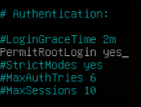
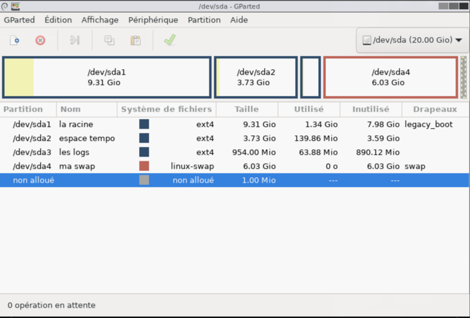
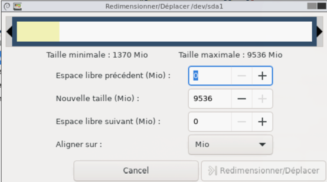
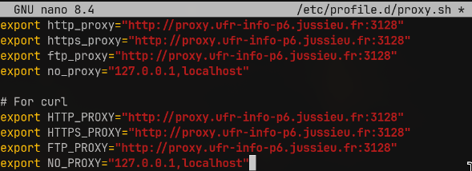
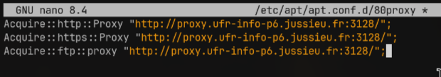

# UNIX TP 1

## 1. Récupération ISO d'installation

Les ISO d'installations sont disponibles sur les différents miroirs Debian. La liste des miroirs Debian se trouve à cette adresse : https://www.debian.org/mirror/list.fr.html

Il faut ensuite naviguer dans l'arborescence dans le dossier :
```
http://ftp.fr.debian.org/debian/dists/Debian13.3/main/installer-amd64/current/images/netboot/mini.iso
```

### 1.2. Installation

Tout s'est bien passé, mais lors du partitionnement du disque une erreur de l'énoncé a été corrigée : nous avons monté les logs dans un dossier différent `/tmp/var/`, car `tmp` était déjà occupé par les fichiers temporaires.

## 2. Post Installation

### 2.1. SSH

Tout d'abord, on installe SSH avec :
```bash
apt update
apt install ssh
```

Une fois l'installation terminée, on vérifie l'état du service SSH à l'aide de la commande :
```bash
systemctl status ssh
```

Ensuite, on modifie le fichier de configuration du démon SSH situé dans `/etc/ssh/sshd_config` en utilisant un éditeur de texte tel que nano :
```bash
nano /etc/ssh/sshd_config
```

On recherche la ligne `#PermitRootLogin prohibit-password` et on la modifie en :
- Supprimant le `#` pour la décommenter

- Changeant la valeur de `prohibit-password` à `yes` afin d'autoriser la connexion root avec un mot de passe  

    

### 2.2. Commandes

**Vérification de la langue :**

```bash
echo $LANG
# Résultat : en_US.UTF-8
```

**Nom d'hôte :**
```bash
hostname
# Résultat : debiansf

hostname -d
# Résultat : …
```

**Sources APT :**

```bash
cat /etc/apt/sources.list | grep -v -E '^#|^$'
```
Résultat :
```
deb http://deb.debian.org/debian/ trixie main
deb-src http://deb.debian.org/debian/ trixie main
deb http://security.debian.org/debian-security trixie-security main
deb-src http://security.debian.org/debian-security trixie-security main
deb http://deb.debian.org/debian/ trixie-updates main
deb-src http://deb.debian.org/debian/ trixie-updates main
```

**Utilisateurs système :**
```bash
cat /etc/passwd | grep -vE 'nologin|sync'
```
Résultat :
```
root:x:0:0:root:/root:/bin/bash
dhcpcd:x:100:65534:DHCP Client Daemon:/usr/lib/dhcpcd:/bin/false
```

**Liste des partitions :**
```bash
fdisk -l
```
Résultat :
```
Disk /dev/sda: 20 GiB, 21474836480 bytes, 41943040 sectors
Disk model: VBOX HARDDISK
Units: sectors of 1 * 512 = 512 bytes
Sector size (logical/physical): 512 bytes / 512 bytes
I/O size (minimum/optimal): 512 bytes / 512 bytes
Disklabel type: gpt
Disk identifier: AB211222-803A-4FD6-B287-4ABF5590377C

Device        Start      End  Sectors  Size Type
/dev/sda1      2048 19531775 19529728  9.3G Linux filesystem
/dev/sda2  19531776 27344895  7813120  3.7G Linux filesystem
/dev/sda3  27344896 29298687  1953792  954M Linux filesystem
/dev/sda4  29298688 41940991 12642304    6G Linux swap
```

**Liste détaillée des partitions :**
```bash
fdisk -x
```
Résultat :
```
Disk /dev/sda: 20 GiB, 21474836480 bytes, 41943040 sectors
Disk model: VBOX HARDDISK
Units: sectors of 1 * 512 = 512 bytes
Sector size (logical/physical): 512 bytes / 512 bytes
I/O size (minimum/optimal): 512 bytes / 512 bytes
Disklabel type: gpt
Disk identifier: AB211222-803A-4FD6-B287-4ABF5590377C
First usable LBA: 34
Last usable LBA: 41943006
Alternative LBA: 41943039
Partition entries starting LBA: 2
Allocated partition entries: 128
Partition entries ending LBA: 33

Device        Start      End  Sectors Type-UUID                            UUID                                 Name         Attrs
/dev/sda1      2048 19531775 19529728 0FC63DAF-8483-4772-8E79-3D69D8477DE4 F2F64629-8366-48CD-91FD-B5581390A5A6 la racine    LegacyBIOSBootable
/dev/sda2  19531776 27344895  7813120 0FC63DAF-8483-4772-8E79-3D69D8477DE4 E5A789F1-28D3-4293-8026-189C043F6A90 espace tempo
/dev/sda3  27344896 29298687  1953792 0FC63DAF-8483-4772-8E79-3D69D8477DE4 392C28F7-98AB-4620-A0CB-042C526479CA les logs
/dev/sda4  29298688 41940991 12642304 0657FD6D-A4AB-43C4-84E5-0933C84B4F4F EFE0F764-3732-4B85-8922-22D22B7737A1 ma swap
```

**Utilisation de l'espace disque :**
```bash
df -h
```
Résultat (rapport d'utilisation de l'espace du système de fichiers, `-h` = lisible par les humains) :
```
Filesystem      Size  Used Avail Use% Mounted on
udev            967M     0  967M   0% /dev
tmpfs           198M  560K  197M   1% /run
/dev/sda1       9.1G  1.2G  7.5G  13% /
tmpfs           987M     0  987M   0% /dev/shm
tmpfs           5.0M     0  5.0M   0% /run/lock
/dev/sda3       921M   23M  835M   3% /var/log
/dev/sda2       3.6G  1.1M  3.4G   1% /tmp
tmpfs           1.0M     0  1.0M   0% /run/credentials/getty@tty1.service
tmpfs           198M  8.0K  198M   1% /run/user/0
tmpfs           1.0M     0  1.0M   0% /run/credentials/systemd-journald.service
```

## 3. Configurations avancées

### 3.1. Installation automatique

**Preseed** sert à automatiser l'installation du système d'exploitation Debian en répondant à l'avance aux questions posées par l'installeur, sans intervention humaine.

### 3.2. Mode Rescue

Cette méthode consiste à dire au système de lancer un terminal (`/bin/bash`) à la place du processus de démarrage habituel.

**Procédure :**

1. Redémarrer l'ordinateur

2. Dès que le menu GRUB apparaît (l'écran bleu ou noir où on choisit son OS), utiliser les flèches pour sélectionner la ligne Debian (souvent la première)

     

3. Appuyer sur la touche `e` pour éditer les options de démarrage

4. Chercher la ligne qui commence par `linux`. Elle ressemble souvent à :
   ```
   linux /boot/vmlinuz-xxx root=UUID=xxx ro quiet
   ```

    

5. À la fin de cette ligne, ajouter un espace puis le texte suivant :
   ```
   rw init=/bin/bash
   ```

    

6. Appuyer sur `Ctrl + X` ou `F10` pour démarrer avec ces paramètres temporaires

7. Une fois qu'on voit une invite de commande, taper :
   ```bash
   passwd root
   ```

8. Entrer un nouveau mot de passe deux fois et une fois terminé, redémarrer proprement

### 3.3. Redimensionnement de partition

La méthode la plus simple et la plus sûre consiste à utiliser un Live USB de GParted ou d'une distribution comme Ubuntu/Debian Live.

**Procédure :**

1. Démarrer sur la clé USB (dans le cas d'une VM, télécharger l'ISO de GParted Live et démarrer dessus)

2. Lancer l'outil GParted

     

3. Paramétrer le clavier

   

4. On verra alors nos partitions graphiquement. 

     

#### Agrandir la partition racine

Agrandir la partition est le cas le plus simple, à condition d'avoir de l'espace non alloué juste à côté (à droite) de la partition racine.

1. Dans GParted, faire un clic droit sur la partition racine

2. Choisir **Redimensionner/Déplacer**

     

3. Étirer la barre vers la droite pour combler l'espace vide

     

4. Cliquer sur **Redimensionner/Déplacer**

**Note :** Si l'espace vide n'est pas adjacent (par exemple, s'il y a une partition "Swap" entre les deux), il faudra d'abord déplacer la partition Swap avant de pouvoir agrandir la racine.

#### Réduire la partition

Réduire la partition est plus risqué et plus long, car le système doit déplacer physiquement les données vers le début du disque pour libérer de l'espace à la fin. On effectue la même procédure mais on réduit la taille vers la droite.

### 3.4. Configuration du Proxy

Pour définir les paramètres du proxy à l'échelle du système sur Debian à partir de la CLI, nous allons créer un fichier dans le répertoire `/etc/profile.d` et définir les paramètres de proxy qui fonctionneront pour tous les utilisateurs d'un système Debian Linux.

**Procédure :**

1. Créer le fichier de configuration proxy :
   ```bash
   nano /etc/profile.d/proxy.sh
   ```

2. Remplir avec nos valeurs de proxy

     

3. Une fois terminé, ajouter le bit d'exécution au script créé :
   ```bash
   chmod +x /etc/profile.d/proxy.sh
   ```

4. Tout utilisateur du système qui a besoin d'utiliser ces paramètres doit se déconnecter et se reconnecter :
   ```bash
   logout
   ```

#### Configuration du proxy pour APT

1. Créer un fichier dans le répertoire `/etc/apt/apt.conf.d/` :
   ```bash
   nano /etc/apt/apt.conf.d/80proxy
   ```

2. Configurer le fichier selon nos besoins de proxy

     

