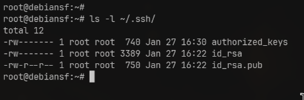
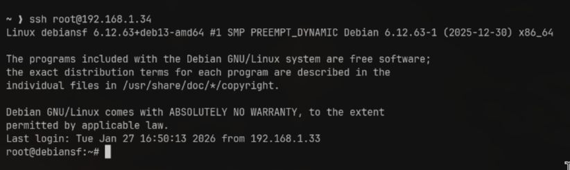

# UNIX TP2

## 1 Secure Shell SSH 

### 1.1 Exercice : Connection ssh root 

Selon le manuel (man sshd_config), cette directive définit si l'utilisateur root peut se connecter en SSH. Voici les différentes options disponibles :

- `yes` : Autorise la connexion root avec n'importe quelle méthode d'authentification (mot de passe ou clé publique).

- `prohibit-password` : L'authentification par mot de passe est désactivée pour l'utilisateur root.

- `forced-commands-only` : Autorise root via clé publique, mais seulement pour exécuter des commandes spécifiques.

- `no` : N'autorise pas l'authentification root peu importe la méthode.

**Avantages, Inconvénients et Cas d'usage**

1. `yes` 
- Avantages : Simplicité absolue. Pas besoin de gérer des clés ou de passer par un compte intermédiaire.

- Inconvénients : Risque de sécurité majeur. Le compte root est une cible privilégiée. Si un attaquant trouve le mot de passe par "brute force", il a les pleins pouvoirs instantanément.

- Quand l'utiliser : Uniquement dans un environnement de laboratoire isolé ou lors d'une phase de déploiement initial très courte. À bannir en production.

2. `prohibit-password` 
- Avantages : Très sécurisé. Les attaques par force brute sur le mot de passe sont impossibles puisque SSH n'accepte que les clés cryptographiques.

- Inconvénients : Nécessite d'avoir copié sa clé publique sur le serveur au préalable.

- Quand l'utiliser : C'est le réglage par défaut recommandé si on a absolument besoin d'un accès root direct (pour des scripts d'administration automatisés, par exemple).

3. `forced-commands-only`
- Avantages : Sécurité maximale pour des tâches spécifiques. L'accès root est "bridé".

- Inconvénients : Très contraignant pour une utilisation humaine normale.

- Quand l'utiliser : Pour des sauvegardes automatisées ou du monitoring où l'outil distant ne doit faire qu'une seule chose précise.

4. `no` 
- Avantages : La meilleure pratique de sécurité. Oblige à se connecter avec un utilisateur standard, puis à utiliser sudo ou su. Cela crée une trace (log) de qui a tenté de devenir root.

- Inconvénients : Un peu plus long au quotidien (deux étapes pour passer root).

- Quand l'utiliser : Dans la majorité des cas. C'est la norme de sécurité standard pour tous les serveurs exposés à Internet.

### 1.2 Exercice : Authentification par clef / Génération de clefs

Pour générer le couple de clefs (publique et privée) sur ma machine hôte (ma machine locale Linux), j'ai utilisé le terminal Ghosty avec l'utilitaire OpenSSH.

```bash 
ssh-keygen -t rsa -b 4096
```

- `-t rsa` : Spécifie le type d'algorithme (RSA est le standard).

- `-b 4096` : Définit une taille de 4096 bits pour une sécurité accrue.

**La question de la "Passphrase"**
Lors de la génération, j'ai laissé le champ passphrase vide comme demandé pour le TP.

Pourquoi est-ce une mauvaise idée en conditions réelles ? La passphrase agit comme un mot de passe qui chiffre la clef privée sur le disque dur.

Sans passphrase : Si quelqu'un vole l'ordinateur ou accède aux fichiers, il peut utiliser la clef privée instantanément pour se connecter à tous nos serveurs. C'est un "single point of failure".

Avec passphrase : Même si le fichier de la clef est dérobé, l'attaquant ne peut rien en faire sans le code pour la déchiffrer. C'est une couche de sécurité indispensable (Authentification à deux facteurs : ce que je possède [la clef] et ce que je sais [la passphrase]).

### 1.3 Exercice : Authentification par clef / Connexion serveur

Pour cet exercice, j'ai utilisé l'utilitaire `ssh-copy-id`, qui permet d'automatiser proprement le dépôt de la clef publique sur le serveur Debian.

**Procédure simplifiée**

Depuis le terminal de ma machine hôte, j'ai exécuté la commande suivante :
```bash
ssh-copy-id root@IP_SERVEUR
```

L'outil m'a demandé le mot de passe de l'utilisateur root une dernière fois, puis a confirmé que la clef avait été ajoutée.

**Ce que l'outil a fait automatiquement** 

Bien que je n'aie tapé qu'une seule commande, `ssh-copy-id` a effectué les actions requises par l'énoncé sur le serveur distant :

1. **Création du dossier** : Il a vérifié l'existence du dossier `/root/.ssh/` et l'a créé si nécessaire.
2. **Gestion du fichier** : Il a créé (ou complété) le fichier `/root/.ssh/authorized_keys` en y injectant le contenu de ma clef publique `id_rsa.pub`.
3. **Sécurisation des droits (Permissions)** : L'outil est programmé pour respecter les exigences d'OpenSSH. Il a automatiquement appliqué les permissions restrictives :
   * Dossier `.ssh` : Droits `700` (Seul root peut y accéder).
   * Fichier `authorized_keys` : Droits `600` (Seul root peut lire/écrire).



### 1.4 Exercice : Authentification par clef : depuis la machine hote

Après l'utilisation de l'outil, j'ai testé la connexion :
```bash
ssh root@IP_SERVEUR
```

**Résultat** : La connexion s'établit instantanément sans demande de mot de passe. L'authentification par clef est maintenant opérationnelle.



### 1.5 Exercice : Sécurisation de l'accès SSH

#### La Procédure : Root par clef uniquement

Pour sécuriser l'accès, on modifie le comportement du démon SSH (sshd). La procédure que tu as trouvée est correcte. Voici les étapes précises à reporter :

**Édition du fichier :**
```bash
nano /etc/ssh/sshd_config
```

**Modifications cibles :**
- `PermitRootLogin prohibit-password` : Cette ligne est cruciale. Elle dit : "Root peut se connecter, mais jamais avec un mot de passe (clés uniquement)".
- `PasswordAuthentication no` : Désactive les mots de passe pour tous les utilisateurs.

#### Qu'est-ce qu'une attaque "Brute-Force" ?

Une attaque par force brute (bruteforce attack) consiste à tester, l'une après l'autre, chaque combinaison possible d'un mot de passe ou d'une clé pour un identifiant donné afin se connecter au service ciblé.

#### Autres techniques de protection (Alternative & Compléments)

Lorsqu'un serveur a plusieurs utilisateurs, l'administrateur dispose d'autres outils pour renforcer la sécurité :

**A. Changer le port par défaut** 

Par défaut, SSH écoute sur le port 22.

- **Action** : Modifier `Port 22` en `Port 2222` (par exemple) dans `sshd_config`.
- **Avantages** : Élimine 99% des attaques automatiques qui ne scannent que le port 22.
- **Inconvénients** : Ce n'est pas une sécurité absolue (un scan de ports complet trouvera le nouveau port).

**B. Fail2Ban (Le "Bouncer")**

C'est un logiciel qui surveille les journaux de connexion.

- **Action** : `apt install fail2ban`.
- **Fonctionnement** : Si une IP se trompe de mot de passe 3 fois, Fail2Ban bloque cette IP au niveau du pare-feu (Firewall) pendant 10 minutes ou plus.
- **Avantages** : Très efficace pour décourager les robots sans bloquer les utilisateurs légitimes.

**C. AllowUsers (La "Liste Blanche")**

- **Action** : Ajouter `AllowUsers alice bob` dans la configuration.
- **Avantages** : Seuls les utilisateurs listés peuvent tenter de se connecter. Même si un attaquant trouve le mot de passe du compte test, il sera rejeté car il n'est pas dans la liste.

**D. L'authentification à deux facteurs (2FA/MFA)**

- **Action** : Utiliser un module comme `libpam-google-authenticator`.
- **Avantages** : Même avec la clé SSH (ou le mot de passe) volée, l'attaquant a besoin du code temporaire sur ton téléphone. C'est le niveau de sécurité bancaire.

## 2. Processus

### 2.1 Etude des processus UNIX 

1. Commande ps pour afficher la liste de tous les processus tournant sur ma machine 
```bash 
ps -eo pid,pcpu,user,comm,%mem,lstart,cputime,stat
``` 

L'information TIME correspond au cumulative CPU time, "[DD-]HH:MM:SS" format.

Le processus ayant utilisé le plus le processeur dur ma machine : 
```bash 
%CPU USER     COMMAND         %MEM     TIME                  STARTED STAT
0.4 root     kworker/0:3-eve  0.0 00:00:04 Mon Feb  2 09:44:44 2026 I
```

Le premier processus démarré lancé après le démarrage du système : 
```bash 
ps -eo pcpu,user,comm,%mem,lstart,cputime,stat --sort=lstart
%CPU USER     COMMAND         %MEM                  STARTED     TIME STAT
 0.0 root     systemd          0.7 Mon Feb  2 09:44:43 2026 00:00:00 Ss
```

Le processus avec l'ID 1 est lancé au démarrage du système. Son heure de lancement correspond donc à l'heure de boot.
```bash 
ps -p 1 -o lstart=
Mon Feb  2 09:44:43 2026
```

Temps depuis lequel le serveur tourne :
```bash 
uptime -p
up 35 minutes
```
Nombre de processus en cours sur ma machine :
```bash
grep 'processes' /proc/stat
processes 1329
```

2. Commande affichant le processus parent :
```bash 
ps -o ppid
```

Pour trouver lees processus parent de `ps` on peut rajouter l'argument `-H` (hiérarchie), qui affiche les processus avec une indentation, pour signifier la parenté :
```bash 
ps -eo pid,ppid,comm -H 
PID    PPID COMMAND
1       0 systemd
687       1   sshd
1945     687     sshd-session
   1952    1945       sshd-session
   1953    1952         bash
   2126    1953           ps
```

3. Pour récupérer les parents de bash on peut aussi utiliser la commande `pstree` : 
```bash 
apt update
apt search pstree 
apt install psmisc
```

Après l'installation on tape la commande suivante :
```bash 
pstree -s $$
systemd───sshd───sshd-session───sshd-session───bash───pstree
```

- `$$` est une variable shell qui contient le PID de notre terminal actuel.

- `-s` (show parents) affiche les ancêtres du processus spécifié.

4. La commande `top`

Pour afficher les processus trier par occupation de mémoire dans l'ordre décroissant, il suffit d'appuyer sur la touche `M` une fois dans l'outil `top`.


Le processus le plus gourmand sur ma machine est `systemd`, qui est un system and service manager for Linux operating systems.

- Voici les touches magiques pour personnaliser notre vue :

`z` : Active/désactive l'affichage en couleurs.

`b` : Met en gras ou en surbrillance la colonne de tri (très utile pour voir ce que l'on fait).

`<` et `>` : Permettent de déplacer la colonne de tri vers la gauche ou la droite. C'est la méthode la plus simple pour changer la colonne de tri (passer de %CPU à %MEM ou PID).

`f` : Accède au menu de gestion des champs (Field Management) pour ajouter/supprimer des colonnes ou choisir le tri de façon précise.

- `htop` est une version moderne et beaucoup plus conviviale de top.


**Avantages de htop**
Visuel : Utilise des barres de couleur pour le CPU (par cœur), la RAM et le Swap. C'est instantanément lisible.

Navigation : On peut faire défiler la liste verticalement et horizontalement avec les flèches du clavier.

Interaction : On peut tuer un processus (F9) ou changer sa priorité (F7/F8) sans avoir à taper son PID manuellement.

Recherche : Supporte la recherche (/) et le filtrage (F4) de processus de manière intuitive.

**Inconvénients de htop**
Installation : Il n'est pas toujours installé par défaut sur les systèmes minimaux, alors que top est présent partout.

Ressources : Il consomme légèrement plus de ressources que top, ce qui peut compter sur des systèmes très anciens ou très chargés.

## 3 Arrêt d'un processus

On souhaitye arrêter un processus avec les commandes `jobs` et `fg`. 


```bash
jobs
[1]-  Stopped                 ./date.sh
[2]+  Stopped                 ./date-toto.sh
```


On souhaite faire la même chose mais cette fois avec `ps` et `kill`.
```bash
ps
    PID TTY          TIME CMD
   1953 pts/0    00:00:00 bash
  15909 pts/0    00:00:00 date.sh
  15918 pts/0    00:00:00 sleep
  15919 pts/0    00:00:00 date-toto.sh
```

Cependant notre script, la commande sleep 1 est un processus fils. Quand le shell exécute sleep, il se met en pause et attend que le fils se termine avant de passer à la commande suivante (echo).
Lorsqu'on envoies un kill au script parent (date.sh), celui-ci reçoit le signal, mais il est "occupé" à attendre la fin du sleep.
Par défaut, le shell ne traite les signaux en attente qu'une fois que la commande en cours (le fils) est terminée.

Dès que le sleep 1 s'arrête, le shell reçoit enfin le signal, mais il a une fraction de seconde pour l'interpréter avant de lancer l'instruction suivante (echo, puis date, puis un nouveau sleep). Si le signal arrive pile au moment où un nouveau sleep démarre, tu repars pour un tour d'attente.

Contrairement au kill standard (SIGTERM) qui demande au processus de s'arrêter lui-même, le SIGKILL (9) ne s'adresse pas au script. Il s'adresse au Noyau (Kernel).

Le Kernel voit le signal -9 et supprime immédiatement le processus de la table des processus, sans demander l'avis du script et sans attendre la fin du sleep en cours.
```bash
ps
    PID TTY          TIME CMD
   1953 pts/0    00:00:00 bash
  15909 pts/0    00:00:00 date.sh
  15918 pts/0    00:00:00 sleep
  15919 pts/0    00:00:00 date-toto.sh
  15928 pts/0    00:00:00 sleep
  15942 pts/0    00:00:00 ps
root@debiansf:~# kill -9 15909
[1]-  Killed                  ./date.sh
root@debiansf:~# ps
    PID TTY          TIME CMD
   1953 pts/0    00:00:00 bash
  15919 pts/0    00:00:00 date-toto.sh
  15928 pts/0    00:00:00 sleep
  15957 pts/0    00:00:00 ps
  root@debiansf:~# kill -9 15919
root@debiansf:~# ps
    PID TTY          TIME CMD
   1953 pts/0    00:00:00 bash
  15959 pts/0    00:00:00 ps
[2]+  Killed                  ./date-toto.sh
```
